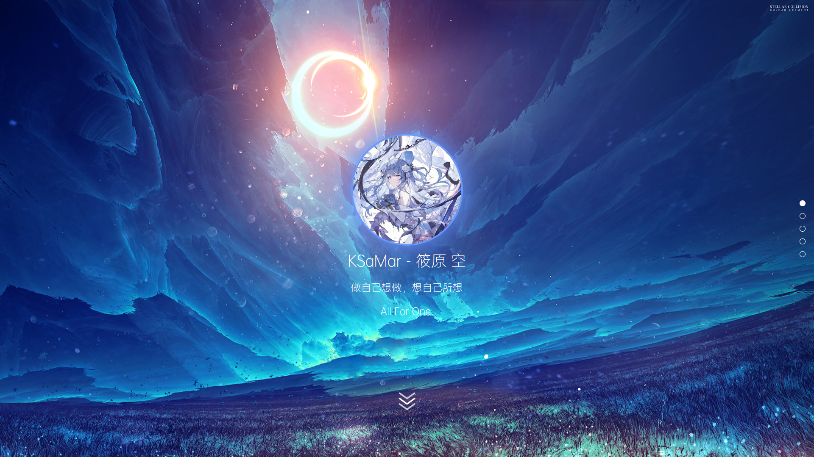
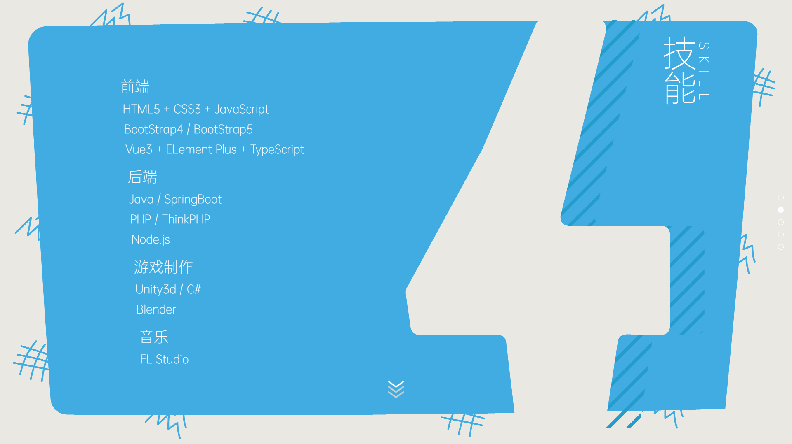
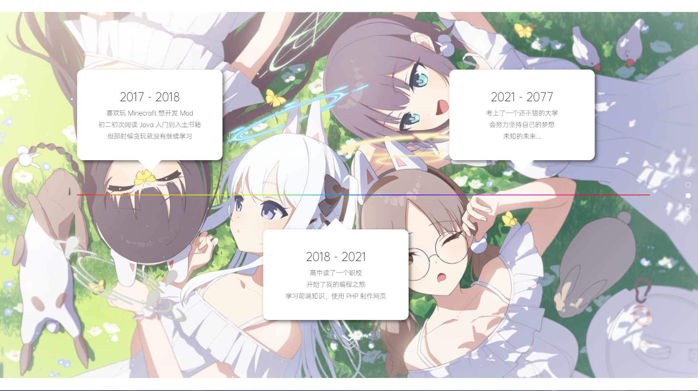
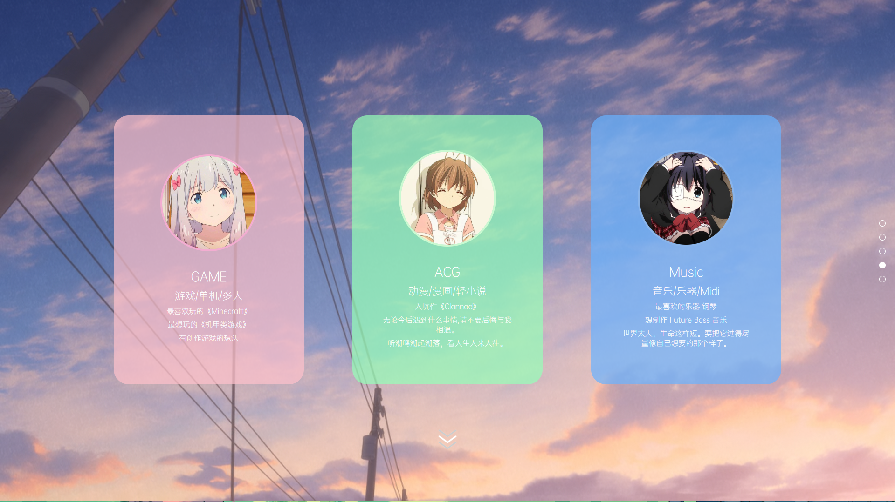
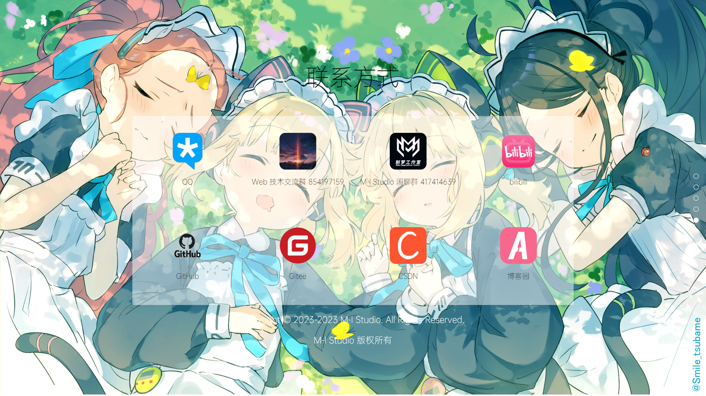

# 二次元风格の个人简介网页

名称：二次元风格の个人简介网页

作者：KSaMar

日期：2023-6-20

描述：一个超级好看的二次元风格の个人简介网页

## 开发环境

网页制作工具：VSCode

## 简介

全屏滚动
可自行设置背景图片，推荐大小为 1920x1080

## 项目图片

### 个人主页

### 技能介绍

### 时间线

### 兴趣爱好

### 联系方式

## Bilibili

欢迎在 B 站上关注我

[哔哩哔哩](https://space.bilibili.com/51110915) KSaMar